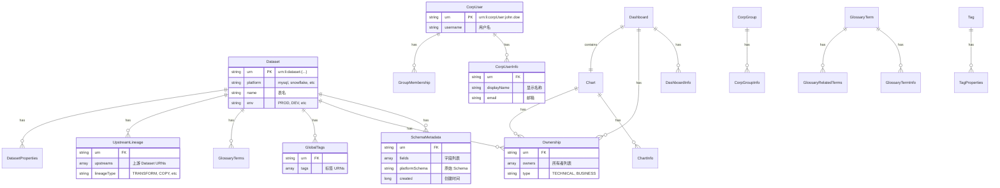

# DataHub 架构图集

本文档包含 DataHub 系统的核心架构图，帮助理解系统设计和数据流。

## 1. 系统整体架构（C4 Level 1）

**说明**：
- **用户层**：不同角色通过 Web 界面访问 DataHub
- **应用层**：三大核心服务（Frontend、GMS、Ingestion）
- **存储层**：MySQL（主存储）+ Elasticsearch（搜索）+ Kafka（事件流）
- **数据源层**：100+ 支持的数据源

---

## 2. 容器架构（C4 Level 2）

**核心组件**：

1. **datahub-frontend**：用户认证 + 反向代理
2. **datahub-gms**：元数据服务核心，提供多种 API
3. **metadata-jobs**：异步事件处理器
4. **存储层**：MySQL（持久化）+ ES（搜索）+ Kafka（消息）

---

## 3. 元数据导入流程（序列图）

**关键步骤**：

1. **采集**：Python CLI 从数据源提取元数据
2. **发送**：MCE 事件发送到 Kafka
3. **持久化**：MCE Consumer 写入 MySQL
4. **审计**：GMS 发布 MAE 事件
5. **索引**：MAE Consumer 更新 Elasticsearch

---

## 4. GraphQL 查询流程（序列图）

**性能优化**：

- **DataLoader**：批量加载，避免 N+1 查询问题
- **缓存**：EntityService 使用 Caffeine 缓存热点数据
- **索引优化**：MySQL 使用复合索引 (urn, aspect)

---

## 5. 数据模型（ER 图）

**核心实体类型**：

1. **Dataset** - 数据集（表、视图、流）
2. **Dashboard** - 仪表板
3. **Chart** - 图表
4. **CorpUser** - 用户
5. **CorpGroup** - 用户组
6. **GlossaryTerm** - 术语
7. **Tag** - 标签

**Aspect 类型**：

- **Info Aspects**：基础信息（名称、描述等）
- **Schema Aspects**：结构信息
- **Ownership Aspects**：所有权
- **Lineage Aspects**：血缘关系
- **Tag/Term Aspects**：分类标注

---

## 6. 模块依赖图

**依赖说明**：

1. **metadata-models** 是基础，所有模块依赖其生成的代码
2. **metadata-io** 提供数据访问抽象，被 GMS 和 Jobs 使用
3. **datahub-graphql-core** 独立可部署，也可嵌入 GMS
4. **前端层** 通过 GraphQL API 消费后端服务
5. **采集层** 通过 Kafka 事件与后端解耦

---

## 7. 事件流架构

**事件类型**：

1. **MCE (Metadata Change Event)**：外部元数据变更请求
2. **MAE (Metadata Audit Event)**：审计日志，包含变更前后状态
3. **PE (Platform Event)**：平台级事件（如用户操作、系统告警）
4. **FMCE (Failed MCE)**：验证失败的 MCE，用于调试

---

## 8. 部署架构（生产环境）

**生产配置**：

- **Frontend**：2 副本 + HPA (2-5)
- **GMS**：3 副本 + HPA (3-10)
- **Jobs**：按 topic 分片，2-4 副本
- **MySQL**：RDS Multi-AZ，读写分离
- **Elasticsearch**：3 节点集群，16GB heap
- **Kafka**：3 broker，replication factor = 3

**资源配置**：

- **GMS Pod**：4 CPU, 8GB RAM
- **Frontend Pod**：2 CPU, 4GB RAM
- **Job Pod**：2 CPU, 4GB RAM

---

## 总结

这些架构图涵盖了 DataHub 的核心设计：

1. **系统架构**：用户 → 应用 → 存储层的三层结构
2. **容器架构**：微服务组件和职责划分
3. **数据流**：元数据导入和查询的完整路径
4. **数据模型**：实体和 Aspect 的关系
5. **模块依赖**：代码库的组织结构
6. **事件流**：异步处理和解耦设计
7. **部署架构**：生产环境的高可用配置

下一步阅读：[数据模型详解](./03-data-model.md)
